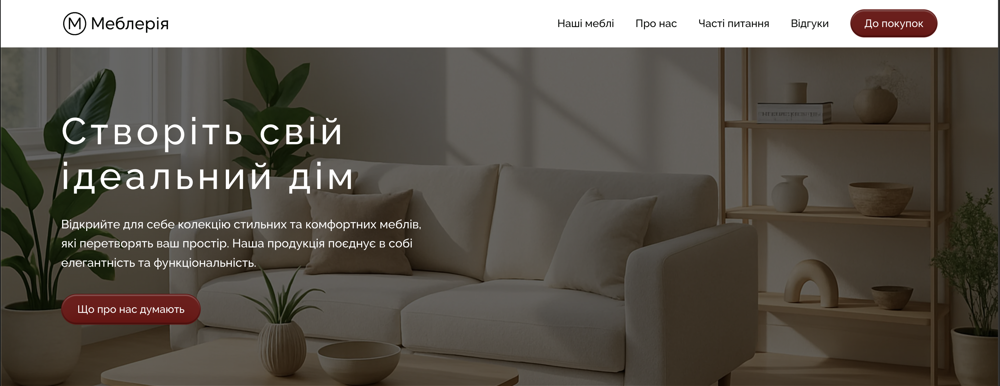

# Mebleriia — Furniture Store Catalog

[Українська версія](./README.md)

Project by the **Bug Hunters** development team. This is a modern frontend application for an online furniture store catalog, built with a strong focus on UI usability, full responsiveness (Mobile-First), and performance.

## 📋 Project Overview

The "Mebleriia" website allows users to:
- Browse a catalog of quality furniture.
- View detailed information about each product (image gallery, descriptions, available colors, dimensions).
- Submit order and contact requests through forms with reliable validation.
- Explore additional information (for example, FAQ or terms) through convenient accordions.

## 🛠 Technologies and Libraries

The project is built with a vanilla frontend stack and modern tooling:

- **HTML5 & CSS3** (BEM methodology, Flexbox, Grid)
- **JavaScript (ES6+)**
- **Vite** — project bundler and local dev server.
- **Swiper** — product sliders and carousels.
- **Accordion-js** — expandable content handling (FAQ).
- **iziToast** — popup notifications shown after form submission.
- **Axios** — HTTP requests.
- **vite-plugin-html-inject** — modular HTML partial injection.

## 🚀 Key Features

- **Strict Mobile-First responsiveness**: The interface scales smoothly from smartphones (320px-375px) to wide screens (1440px+).
- **Advanced modal windows**: Custom product and order modals with carefully designed spacing and gallery behavior.
- **Custom UI elements**:
  - Dynamic product color selection.
  - Rating block (css-star-rating).
  - Form input validation with clear visual error hints.

## 📸 Screenshots

### Home Screen



### Catalog and Filtering

[Open screenshot](./docs/screenshots/catalog-desktop.png)

### Product Modal

[Open screenshot](./docs/screenshots/product-modal-desktop.png)

### FAQ and Reviews

[Open screenshot](./docs/screenshots/faq-reviews-desktop.png)

### Mobile Version

[Open screenshot](./docs/screenshots/mobile-home.png)

## 💻 Run Locally

To run the project locally, follow these steps:

1. Clone the repository:
   ```bash
   git clone https://github.com/vitaliifedunyk/bug-hunters.git
   ```
2. Install the required NPM packages:
   ```bash
   npm install
   ```
3. Start the local development server:
   ```bash
   npm run dev
   ```
   The project will open in the browser at `http://localhost:5173/`.

To build the production version:
```bash
npm run build
```

## 👥 Bug Hunters Team

- Vitalii Fedunyk — Team Lead
- Alina Kozlyuk — Scrum Master
- Slava Sobchuk — Developer
- Andriy Proshak — Developer
- Sergio Shambir — Developer
- Kateryna Ognieva — Developer
- Vladislav Petrov — Developer
- Stanislaw Skilskyy — Developer
- Nataliia Myshenkova — Developer
- Kateryna Nehoda — Developer

## 🔗 Important Links

- [Live page (GitHub Pages)](https://vitaliifedunyk.github.io/bug-hunters/)
- [Figma design files](https://www.figma.com/design/xmuUuDiEAbT0mjmpgzPrc0/%D0%9C%D0%B5%D0%B1%D0%BB%D0%B5%D1%80%D1%96%D1%8F?node-id=5999-10563&p=f&t=zeEGaQ5CxjGkOlwX-0)
- [API documentation](https://furniture-store-v2.b.goit.study/api-docs/)
